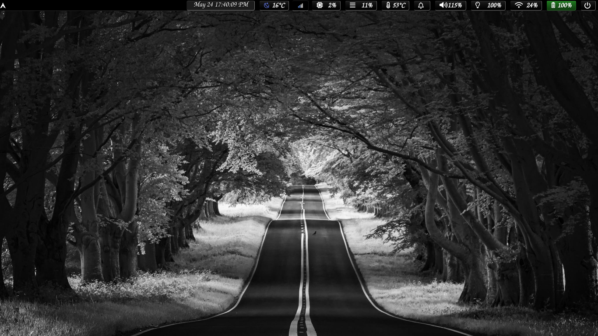
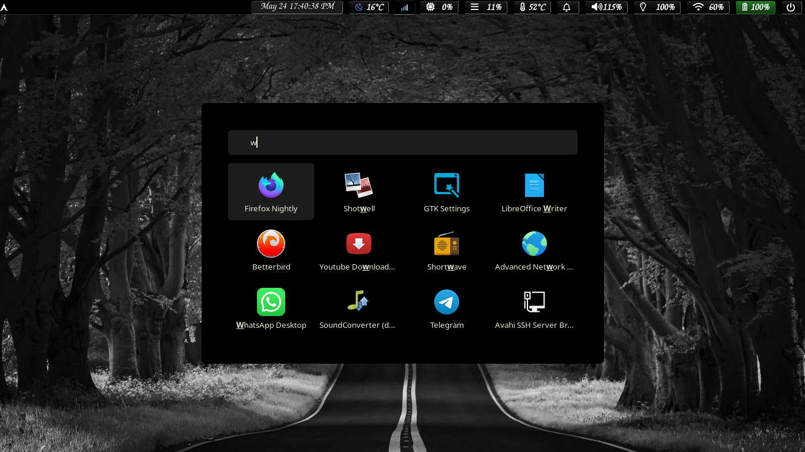

# Labwc Dotfiles

  

Lightweight Openbox-style Wayland Compositor on Arch Linux.

---

## ✨ Features
- **Classic Aesthetics:** Clearlooks-3.4 theme with 8px rounded corners.
- **Waybar Drawers:** Grouped power and battery modules that expand on hover.
- **Theme Switcher:** Click the backlight icon in Waybar to switch themes.
- **Openbox Familiarity:** XML configuration with standard key/mouse bindings.

## 📖 Documentation & Installation

For full instructions, keybinds, and Waybar configuration, please visit the **[Official Documentation Website](https://wgparch.codeberg.page/labwc/)**.

## 📸 Screenshots

